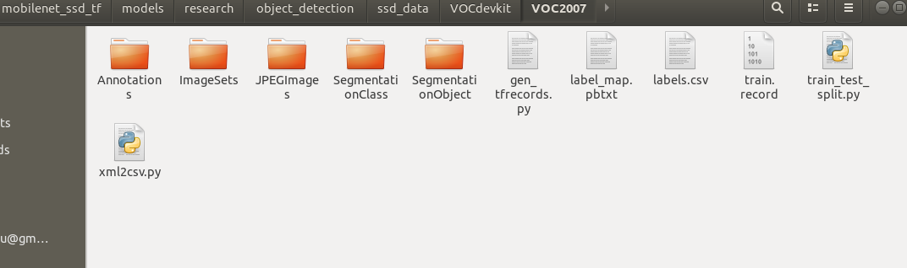
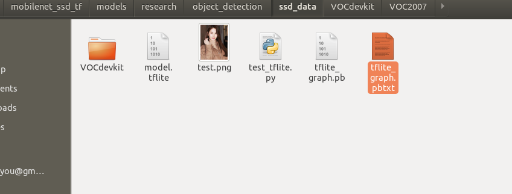

# tensorflow mobilenet_ssd_v2的训练和移植到Android移动端，优化实时检测手势


[tensorflow+ssd_mobilenet实现目标检测的训练](https://www.cnblogs.com/gezhuangzhuang/p/10613468.html)

[TensorFlow基于ssd_mobilenet模型实现目标检测](https://www.cnblogs.com/White-xzx/p/9503203.html)

[使用TransferLearning实现环视图像的角点检测——Tensorflow+MobileNetv2_SSD](https://www.cnblogs.com/hayley111/p/12918678.html)

[MobileNet SSD V2模型的压缩与tflite格式的转换](https://www.jianshu.com/p/20f7f3755ddd)

[使用TensorFlow Lite将ssd_mobilenet移植至安卓客户端](https://blog.csdn.net/qq_26535271/article/details/83031412)

整个项目代码(包括models和android，不包括编译的tensorflow):[代码地址]()
项目中数据只有一类手势，android里面有量化和非量化两种模型

### 环境准备
1. 克隆models     
新建mobile_ssd_tf文件夹,`git clone https://github.com/tensorflow/models` 放到mobile_ssd_tf下面
2. 编译tensorflow    
`git clone https://github.com/tensorflow/tensorflow`，安装protobuf,bazel等
[tensorflow编译参考](https://zhuanlan.zhihu.com/p/46566618)
tensorflow 1.13.1,bazel 0.19.1(注意tf和bazel版本对应，不然出错)
```
cd tensorflow/   
bazel build tensorflow/python/tools:freeze_graph
bazel build tensorflow/contrib/lite/toco:toco
```
### 数据制作
进入models/research/object_detection目录，下面工作基本都在这个目录下进行
```
mkdir ssd_data
```
1. labelImg工具标注数据集，jpg格式图片放到VOCdevkit/VOC2007/JPEGImages目录下,xml文件放到VOCdevkit/VOC2007/Annotations文件夹下面
2. train_test_split.py把xml分为train,test,val三部分，
3. xml2csv.py把xml转csv
4. gen_tfrecords.py生成tfrecord
5. 在ssd_data下面新建label_map.pbtxt
```
item {
id: 1    #id从1开始编号
name: 'name of class1'
}
item {
id: 2
name: 'name of class2'
}  

```

最终目录如下


### 训练
1. **进入models/research/object_detection目录**
   
下面在这个目录下进行工作
```
   mkdir ssd_model
```
从samples/config下面拷贝一个配置文件(就是要训练的模型),放到ssd_model下面(我选的是ssd_mobilenet_v2_coco.config，还有其他各种版本的，看需要选择),修改这个配置文件
> num_classes:前景类别数目+1(背景)
input_path:上面生成的tfrecord路径
label_map_path:label_map.pbtxt的路径
fine_tune_checkpoint:预训练模型的路径(可以注释掉从头开始训练)
其他学习率,batch_size,num_steps,height,width等等看情况调节

从[model zoo](https://github.com/tensorflow/models/blob/master/research/object_detection/g3doc/tf1_detection_zoo.md)(model zoo给出了coco数据集上一些检测模型的时间和mAP),下载预训练模型放到ssd_model下面(也可以不下载，从头开始训练，我下的是这个ssd_mobilenet_v2_coco_2018_03_29.tar.gz)

1. **训练**
```
python train.py --logtostderr --pipeline_config_pathssd_model/ssd_mobilenet_v2_coco.config --train_dir=ssd_data
```
**注**:新版train.py在legacy目录下，先把它copy到research下。
训练生成的模型文件和日志都在ssd_data目录下面。
`tensorboard --logdir=ssd_data/`查看训练日志

**报错：from nets your-net-name ModuleNotFoundError: No module named 'nets'**
research/slim下运行：
python setup.py build
python setup.py install


新版也可以用下面方法训练
```
python model_main.py --alsologtostderr  --pipeline_config_path=...  --model_dir=...
```
3. **测试**
(新版eval.py在legacy目录下，所以先拷贝出来)
这里将train产生的pipeline.config重命名为train_pipeline.config(因为eval也会产生pipeline.config,会覆盖掉)
```
python eval.py --logtostderr --checkpoint_dir=ssd_data/ --eval_dir=ssd_data/ --pipeline_config_path=ssd_data/train_pipeline.config
```

**ValueError: Image with id b'one_heart11.jpg' already added.**
ssd_mobilenet_v2_coco.config和train_pipeline.config里面eval_config下num_examples值改为自己的，默认8000可能太大了

### 模型导出与转换
1. **导出pb格式:**

```
python export_tflite_ssd_graph.py --pipeline_config_path=ssd_data/pipeline.config --trained_checkpoint_prefix=ssd_data/model.ckpt-200000 --output_directory=ssd_data/ --add_postprocessing_op=true
```

产生tflite_graph.pb和tflite_graph.pbtxt文件


2. **导出tflite格式:**(可以从上一步产生的tflite_graph.pbtxt中查看输入节点，输出节点名称和shape)
切换到第一步编译的tensorflow目录下面

```
bazel run tensorflow/contrib/lite/toco:toco 
--input_file=tflite_graph.pb 
--output_file=model.tflite 
--input_shapes=1,300,300,3 
--input_arrays=normalized_input_image_tensor 
--output_arrays='TFLite_Detection_PostProcess','TFLite_Detection_PostProcess:1','TFLite_Detection_PostProcess:2','TFLite_Detection_PostProcess:3' 
--inference_type=FLOAT 
--allow_custom_ops
```
或者执行

```
cd tensorflow/lite/python 　　　
python tflite_convert.py  --graph_def_file=tflite_graph.pb --output_format=TFLITE --output_file=model.tflite --inference_type=FLOAT --input_arrays='normalized_input_image_tensor' --output_arrays='TFLite_Detection_PostProcess','TFLite_Detection_PostProcess:1','TFLite_Detection_PostProcess:2','TFLite_Detection_PostProcess:3' --input_shapes=1,300,300,3 --allow_custom_ops
```


加参数　--mean_values=128 --std_dev_values=128 --inference_type=QUANTIZED_UINT8可以量化，但是预训练模型要选带quantized的config文件，后面会在介绍训练量化版本的模型。

将生成的model.tflite放到ssd_data目录里，像下面一样,然后测试(我已经把checkpoint等文件删了，所以这个目录少了很多模型文件，只有pb格式的和tflite格式的)


   pc上测试tflite:
   `python test_tflite.py`

### 移植到android项目
1. **下载android项目**
tensorflow官方demo地址[https://github.com/tensorflow/examples/tree/master/lite/examples/object_detection/android]

`svn https://github.com/tensorflow/examples/trunk/lite/examples/object_detection/android`拉取android子文件夹
然后android studio加载项目

2. **做些修改**
assets/文件夹下面放tflite模型文件
labelmap2.txt放你的类别名称
修改名字detect2.tflite,labelmap2.txt(不改的话会覆盖掉你的模型)
我只有一类前景,所以改成下面的(???表示背景)
```
???
oneheart
```
改DetectorActivity.java:
```java
TF_OD_API_IS_QUANTIZED = false;//如果之前没量化,这里要改成false
TF_OD_API_MODEL_FILE = "detect2.tflite";
TF_OD_API_LABELS_FILE = "file:///android_asset/labelmap2.txt";
```
DetectorTest.java也有上面表示两个文件路径的变量，我也改了，可以全局查找，全部改为自己的。
我还改了TFLiteObjectDetectionAPIModel.java里面的labelOffset为0,因为我发现不改下标会有溢出。

3. **结果**
模型大约18M,运行时间约300ms
效果:

###　训练量化版本和时间优化
[TensorFlow Mobilenet SSD模型压缩并移植安卓上以达到实时检测效果](https://blog.csdn.net/qq_26535271/article/details/84930868?utm_medium=distribute.pc_relevant.none-task-blog-BlogCommendFromMachineLearnPai2-2.channel_param&depth_1-utm_source=distribute.pc_relevant.none-task-blog-BlogCommendFromMachineLearnPai2-2.channel_param)

参考上面这篇文章，从**量化,修改图片尺寸和修改depth_multiplier**等角度优化时间。(depth multiplier作为一个因子与网络中各层的channel数相乘，depth_multiplier越小，网络中feature map的channel数越少)
这次将samples/config/ssd_mobilenet_v2_quantized_300x300_coco.config拷贝出来放到ssd_model下面,从model zoo里面下ssd_mobilenet_v2_quantized_coco.tar预训练模型放到ssd_model下面。
如上面修改配置文件,这里我还把图片尺寸fixed_shape_resizer改为180x180。
我暂时没有改depth_multiplier参数，可以试验下0.75看看效果。
训练前删除ssd_data下之前生成的训练的模型和日志，不然可能会有影响。
1. **开始训练**
```
python3 train.py --logtostderr --pipeline_config_path=ssd_model/ssd_mobilenet_v2_quantized_300x300_coco.config　--train_dir=ssd_data
```

2. **导出pb模型**
```
python export_tflite_ssd_graph.py --pipeline_config_path=ssd_data/pipeline.config --trained_checkpoint_prefix=ssd_data/model.ckpt-9571 --output_directory=ssd_data/ --add_postprocessing_op=true
```

3. **导出tflite格式模型**
```
python tflite_convert.py  --graph_def_file=tflite_graph.pb --output_format=TFLITE --output_file=model_quantized.tflite --inference_type=FLOAT --input_arrays='normalized_input_image_tensor' --output_arrays='TFLite_Detection_PostProcess','TFLite_Detection_PostProcess:1','TFLite_Detection_PostProcess:2','TFLite_Detection_PostProcess:3' --input_shapes=1,180,180,3 --allow_custom_ops --mean_values=128 --std_dev_values=128 --inference_type=QUANTIZED_UINT8
```
4. **移植到android项目里面**
训练好的模型文件放到assets/目录下面
修改DetectorActivity.java里面的几个变量
```java
   private static final int TF_OD_API_INPUT_SIZE = 180;
   private static final boolean TF_OD_API_IS_QUANTIZED = true;//这里改为true
   private static final String TF_OD_API_MODEL_FILE = "model_quantized.tflite";
   private static final String TF_OD_API_LABELS_FILE = "file:///android_asset/labelmap2.txt";
```
5. **效果** 
模型大约4M,运行时间约20-30ms
运行效果: